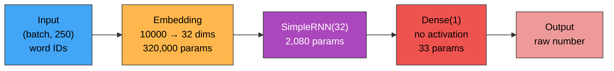
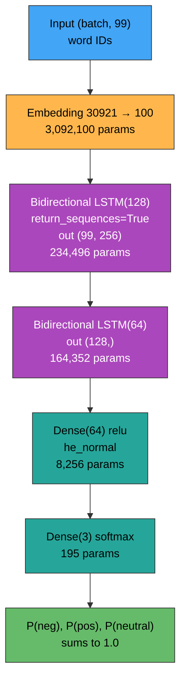

<div align="center">

# 💬 Sentiment Analysis — A Line-by-Line Tutorial

**Two sentiment models, built from scratch: a binary RNN on IMDB movie reviews, and a 3-class bidirectional LSTM on 74,000 tweets.**

[](https://python.org)
[](https://tensorflow.org)
[](https://spacy.io)
[](#does-it-actually-work)
[](LICENSE)

</div>

> [!NOTE]
> This repo contains **two separate projects** that share a theme, not one pipeline. The IMDB notebooks are the learning exercise; the Twitter notebook is the real build. This README walks through both, top to bottom, and ends with the bugs worth fixing — several of which are genuinely instructive.

---

## The big picture

```mermaid
flowchart TD
    subgraph P1["🎬 Part 1 — IMDB (learning exercise)"]
        A1["keras.datasets.imdb<br/>pre-tokenised reviews"] --> A2["pad to 250 tokens"]
        A2 --> A3["Embedding → SimpleRNN(32) → Dense(1)"]
        A3 --> A4["Binary: positive / negative<br/>~77% val accuracy"]
    end

    subgraph P2["🐦 Part 2 — Twitter (the real build)"]
        B1["twitter_training.csv<br/>74,682 raw tweets"] --> B2["7-step text cleaning<br/>lowercase, HTML, URLs,<br/>punctuation, stopwords,<br/>emoji, lemmatise"]
        B2 --> B3["Tokenizer + pad to 99"]
        B3 --> B4["Embedding(100) → BiLSTM(128)<br/>→ BiLSTM(64) → Dense → Softmax(3)"]
        B4 --> B5["3-class: neg / pos / neutral<br/>87.6% test accuracy"]
    end

    style A1 fill:#f9a825,stroke:#333,color:#000
    style A4 fill:#ef9a9a,stroke:#333,color:#000
    style B1 fill:#42a5f5,stroke:#333,color:#000
    style B2 fill:#ffb74d,stroke:#333,color:#000
    style B4 fill:#ab47bc,stroke:#333,color:#fff
    style B5 fill:#66bb6a,stroke:#333,color:#000
```



## What's in the repo

| File | What it is |
|---|---|
| `j7_Deeplearning.ipynb` | **IMDB, first attempt.** 17 cells, Keras 2.x / Python 3.8. Prints the raw model output. |
| `j5.ipynb` | **IMDB, second pass.** 20 cells, Keras 3 / Python 3.10. Same model, plus loss plots, weight saving, and a threshold check. |
| `sentiment-analysis-lstm.ipynb` | **The main project.** 90 cells with markdown narration. Full pipeline from raw CSV to a saved, reloadable model. |
| `twitter_training.csv` | 74,682 tweets. Four unnamed columns: an id, a topic, a sentiment label, the text. |
| `twitter_validation.csv` | 1,758 rows, same format. **Never loaded by any notebook** — the validation split is carved out of the training file instead. |
| `elonmusk.csv` | 27,658 tweets with `Datetime, Tweet Id, Text, Username`. **Not referenced anywhere.** Presumably staged for a future inference run. |
| `LICENSE` | LGPL-2.1. |

## Running it

```bash
git clone https://github.com/Pa-yfi/sentiment-analysis.git
cd sentiment-analysis

python -m venv venv
source venv/bin/activate          # Windows: venv\Scripts\activate

pip install tensorflow pandas numpy matplotlib seaborn scikit-learn \
            beautifulsoup4 spacy emoji wordcloud
python -m spacy download en_core_web_sm

jupyter notebook
```

Two warnings before you hit Run All on the big notebook. The cleaning stage runs spaCy over 74,000 tweets **twice** and takes a long while on CPU. And training took **~11 minutes per epoch × 13 epochs ≈ 2.5 hours** even on a GPU — see [bug #9](#known-bugs-and-how-to-fix-them) for the one-word change that fixes most of that.

---

# Part 1 — The IMDB notebooks

`j7_Deeplearning.ipynb` and `j5.ipynb` are 95% the same file. Read `j7` as the draft and `j5` as the revision; I'll walk `j5` and flag where `j7` differs, because the differences are where the learning happened.

### Step 1 — Imports and loading

```python
import numpy as np
from keras.datasets import imdb
from tensorflow.keras.preprocessing.sequence import pad_sequences
from keras.layers import Dense, SimpleRNN, Embedding, LSTM
from keras.models import Sequential

numwords = 10000
(X_train, y_train), (X_test, y_test) = imdb.load_data(num_words=numwords, maxlen=250)
```

The IMDB dataset ships with Keras: 50,000 movie reviews, half positive and half negative, already tokenised into integers. You never see raw text — a review arrives as `[1, 14, 22, 16, 43, 530, ...]` where each number is a word's rank by frequency across the whole corpus.

`LSTM` is imported but never used. Leftover.

The two arguments do very different things, and the difference matters:

- **`num_words=10000`** — keep only the 10,000 most common words. Anything rarer is replaced by an out-of-vocabulary marker. This caps the Embedding layer's size.
- **`maxlen=250`** — **drop every review longer than 250 tokens entirely.** Not truncate. Drop.

That second one is expensive. It cuts the training set from 25,000 reviews to **17,121** — about a third of the data thrown away before training starts. If the intent was "cap reviews at 250 tokens," `pad_sequences` already does exactly that two cells later, without discarding anything.

```python
X_test[0]
```

Prints a plain Python list of integers. Confirming that the data really is pre-encoded.

### Step 2 — The word index, and the off-by-three that breaks decoding

```python
word_index = imdb.get_word_index()

for (word, adad) in word_index.items():
    if adad == 15:
        print(word)
        break
```

`adad` is Persian *عدد* — "number." `get_word_index()` returns a dictionary mapping each word to its frequency rank: `{"the": 1, "and": 2, "a": 3, "of": 4, ...}`. The loop searches backwards for rank 15 and prints `for`. (`j7` looks up 14 and prints `as`.)

```python
def adad_to_word(comment):
    jomle = ''
    for x in comment:
        for (word, adad) in word_index.items():
            if adad == x:
                jomle = jomle + ' ' + word
                break
    print(jomle)

comment = X_train[0]
print(len(comment))        # → 218
adad_to_word(comment)
```

`jomle` is *جمله* — "sentence." The function walks each number in a review and searches the dictionary for the word with that rank.

Here's what it printed for `X_train[0]`:

> the as you with out themselves powerful lets loves their becomes reaching had journalist of lot from anyone to have after out atmosphere never more room and it so heart shows to years of every never going and help moments…

That is word salad. And it's a very specific kind of word salad, worth understanding because this exact bug catches almost everyone who uses this dataset.

**The IMDB sequences are offset by 3.** Keras reserves the first four integers for control tokens, then shifts every real word up by 3:

```
 index in the data      meaning                    word_index rank
 ─────────────────────────────────────────────────────────────────
        0               <PAD>   padding                    —
        1               <START> start of review            —
        2               <UNK>   unknown / rare word        —
        3               <UNUSED>                           —
        4               "the"                              1
        5               "and"                              2
        6               "a"                                3
       ...                ...                             ...
        n               word                             n − 3
```

The decoder above looks up `n` directly instead of `n − 3`, so every single word comes out shifted three ranks down the frequency table. You can verify this from the notebook's own numbers. `X_train[0]` begins:

```
   1     14    22    16    43     530        973      1622       1385
   ↓      ↓     ↓     ↓     ↓      ↓          ↓         ↓          ↓
 the     as   you  with   out  themselves powerful   lets      loves      ← what the notebook printed
<START> this  film  was  just  brilliant   casting  location  scenery     ← what it actually says
```

`X_train[0]` is the most-quoted review in machine learning — a genuinely enthusiastic five-star write-up that begins *"this film was just brilliant casting location scenery story direction…"*. The notebook's decoder turned it into nonsense.

The fix is three lines, and it makes the decoder roughly 40,000× faster as a bonus. The original nests a full scan of an 88,584-entry dictionary inside the token loop; inverting the dictionary once turns each lookup into O(1):

```python
index_to_word = {v + 3: k for k, v in word_index.items()}
index_to_word.update({0: '<PAD>', 1: '<START>', 2: '<UNK>', 3: '<UNUSED>'})

def adad_to_word(comment):
    print(' '.join(index_to_word.get(i, '?') for i in comment))
```

Nothing downstream depends on the decoder — the model trains on the integers directly, so this bug costs no accuracy. It costs you the ability to *see* your own data, which during debugging is worth a lot.

### Step 3 — Padding

```python
X_train = pad_sequences(X_train, maxlen=250)
X_test  = pad_sequences(X_test,  maxlen=250)

X_train.shape      # → (17121, 250)
```

Neural networks need every input the same length, but reviews vary. `pad_sequences` fixes that by padding short sequences with zeros and truncating long ones.

Keras defaults to **pre-padding** — zeros go at the front:

```
before:  [ 1, 14, 22, 16, 43, 530, ... ]                    218 tokens
after:   [ 0, 0, 0, ..., 0, 1, 14, 22, 16, 43, 530, ... ]   250 tokens
          └── 32 zeros ──┘└──── the actual review ────┘
```

Printing `X_train[0]` confirms it: 32 leading zeros, then the review. Pre-padding is the sensible default for RNNs — the network reads left to right, so ending on real words rather than a trail of zeros means the final hidden state still remembers the content.

Note that `maxlen=250` here means *truncate to 250*, while the identical argument in `load_data` meant *discard anything over 250*. Same keyword, same number, completely different behaviour.

### Step 4 — The model

```python
model = Sequential()

model.add(Embedding(numwords, 32, input_length=250))
model.add(SimpleRNN(32, input_shape=(numwords, 250)))
model.add(Dense(1))

model.compile(loss='binary_crossentropy', optimizer='rmsprop', metrics=['accuracy'])
```



**Total: 322,113 parameters**, and 99.3% of them live in the Embedding.

**`Embedding(10000, 32)`** is the layer that makes text tractable. It's a lookup table with 10,000 rows and 32 columns: feed it word ID 530 and it returns row 530, a 32-number vector. Those vectors start random and are *learned during training*, so words used in similar contexts drift toward similar vectors. It turns a meaningless integer into a position in a 32-dimensional space where distance means something. Output shape: `(batch, 250, 32)`.

**`SimpleRNN(32)`** reads those 250 vectors one at a time, maintaining a 32-number running state:

```
   h₀=0 ──► [RNN] ──► h₁ ──► [RNN] ──► h₂ ──► ... ──► [RNN] ──► h₂₅₀
              ▲                ▲                         ▲
            word 1           word 2                   word 250
```

Only the final state `h₂₅₀` is passed on — a 32-number summary of the whole review. `SimpleRNN` is the most basic recurrent cell: `h_new = tanh(W·x + U·h_old + b)`, no gates. It's fast and easy to understand, and it suffers badly from vanishing gradients over long sequences, which is precisely what LSTMs were invented to fix. Over 250 timesteps that limitation bites.

The `input_shape=(numwords, 250)` argument is meaningless here — shape is inferred from the Embedding above, and `(10000, 250)` describes nothing real. Keras ignores it.

> [!CAUTION]
> **`Dense(1)` has no activation function, but the loss is `binary_crossentropy`.** This is the notebook's most consequential bug.
>
> A binary classifier's final layer needs `activation='sigmoid'` to squash its output into 0–1 so it can be read as a probability. Without it, the layer emits any real number — including negatives. Meanwhile Keras' `binary_crossentropy` defaults to `from_logits=False`, meaning *"I'm being given probabilities."* It clamps whatever it receives into `[ε, 1−ε]` and takes logarithms.
>
> **`j7` proves it.** Its final cell prints the raw model output for a negative review:
> ```
> [[-0.23621833]]
> ```
> A probability cannot be −0.236. That is a raw logit, and the loss function has been quietly mangling it for five epochs. It's also why the reported losses are so strange — `binary_crossentropy` on a working model sits around 0.2–0.4, not the 0.88 → 1.56 seen here.
>
> Either fix works:
> ```python
> model.add(Dense(1, activation='sigmoid'))      # emit probabilities
> # ── or ──
> model.add(Dense(1))                            # emit logits, and tell the loss
> model.compile(loss=tf.keras.losses.BinaryCrossentropy(from_logits=True), ...)
> ```

`j5` layers a second bug on top: its final cell tests `if yp[0][0] > 0.5` to decide positive vs negative. For a logit the neutral threshold is **0**, not 0.5. With sigmoid added, 0.5 becomes correct.

### Step 5 — `model.summary()` prints nothing, and that's a version story

```python
model.summary()
```

Same code, two Keras versions, two different answers.

**`j7` (Keras 2.x):**
```
 embedding (Embedding)       (None, 250, 32)      320,000
 simple_rnn (SimpleRNN)      (None, 32)             2,080
 dense (Dense)               (None, 1)                 33
 Total params: 322,113
```

**`j5` (Keras 3):**
```
 embedding_1 (Embedding)     ?                   0 (unbuilt)
 simple_rnn_1 (SimpleRNN)    ?                   0 (unbuilt)
 dense_1 (Dense)             ?                   0 (unbuilt)
 Total params: 0
```

Keras 3 deprecated `input_length` on `Embedding` and builds layers lazily — weights don't exist until real data flows through. So a summary before `fit` shows an empty shell. Call `model.build(input_shape=(None, 250))` first, or just move `summary()` after `fit`, and the numbers appear.

Worth internalising: `?` and `0 (unbuilt)` in a Keras 3 summary means *not built yet*, not *broken*.

Where the 322,113 come from:

| Layer | Arithmetic | Params |
|---|---|---|
| Embedding | 10,000 words × 32 dims | 320,000 |
| SimpleRNN | (32 input × 32) + (32 state × 32) + 32 bias | 2,080 |
| Dense | 32 + 1 bias | 33 |

### Step 6 — Training

```python
h = model.fit(X_train, y_train, validation_data=(X_test, y_test), epochs=5)
```

17,121 samples at the default batch size of 32 gives `ceil(17121/32) = 536` batches per epoch, matching the `536/536` in the log:

```
Epoch 1/5   accuracy: 0.5554 - loss: 0.8774 - val_accuracy: 0.6274 - val_loss: 1.4221
Epoch 2/5   accuracy: 0.8152 - loss: 0.5669 - val_accuracy: 0.8373 - val_loss: 0.8540
Epoch 3/5   accuracy: 0.8995 - loss: 0.3862 - val_accuracy: 0.7926 - val_loss: 0.8067
Epoch 4/5   accuracy: 0.9415 - loss: 0.2722 - val_accuracy: 0.8071 - val_loss: 1.1554
Epoch 5/5   accuracy: 0.9681 - loss: 0.1901 - val_accuracy: 0.7732 - val_loss: 1.5605
```

This is a textbook overfitting curve, and it's worth learning to read at a glance:

```
 accuracy
   1.0 │              train ●───────●───────●
       │        ●─────╯                        ← still climbing: 96.8%
   0.8 │  ●────╯  ○─────○                ○
       │         ╱        ╲       ○─────╱ ╲    ← val stalls, then falls: 77.3%
   0.6 │  ○─────╯          ╲─────╯       ╲○
       └────┴────┴────┴────┴────┴───────────
            1    2    3    4    5   epoch
```

Training accuracy rises to 96.8% while validation *peaks at epoch 2* (83.7%) and then declines to 77.3%. Validation loss confirms it, climbing from 0.85 to 1.56. The gap between the curves is memorisation — the model is learning this specific 17,121 reviews, not English sentiment.

**The best model was at epoch 2, and the notebook trained past it and saved the worse one.** Two standard tools prevent exactly this:

```python
early_stopping = tf.keras.callbacks.EarlyStopping(
    monitor='val_loss', patience=2, restore_best_weights=True)
model.add(Dropout(0.5))          # between Embedding and RNN
```

(The Twitter notebook uses both. That's the progression across this repo.)

### Step 7 — The plot, and saving

```python
plt.plot(h.history['loss'],     label='Training Loss')
plt.plot(h.history['accuracy'], label='ACC')
plt.title('Model Loss Over Epochs')
plt.ylabel('ACC')
```

Three things fight each other here. Loss and accuracy live on different scales and different meanings — one goes down when things improve, the other goes up — so plotting them on shared axes makes both harder to read. The title says loss, the y-label says accuracy. And `val_loss` / `val_accuracy` are missing entirely, which are the only two series that reveal the overfitting above.

Two plots, four series, is the version that tells you something:

```python
fig, (ax1, ax2) = plt.subplots(1, 2, figsize=(12, 4))
ax1.plot(h.history['loss'], label='train'); ax1.plot(h.history['val_loss'], label='val')
ax1.set_title('Loss'); ax1.legend()
ax2.plot(h.history['accuracy'], label='train'); ax2.plot(h.history['val_accuracy'], label='val')
ax2.set_title('Accuracy'); ax2.legend()
```

```python
model.save_weights('model.weights.h5')
# model.load_weights('model.weights.h5')
```

Save and load, one commented out depending on which you need. `j7` has the pair the other way round. Note this saves **weights only** — the architecture code must exist to load them back. `model.save('model.keras')` saves both.

### Step 8 — Predicting on your own sentence

```python
jomle = "this movie was very good and really loved it and it is very good would great watch it again because it was amazing great"

s_jomle  = jomle.split(' ')
s_jomle2 = jomle.split(' ')

for i in range(len(s_jomle)):
    s_jomle2[i] = word_index[s_jomle[i]]

s_jomle2 = np.array([s_jomle2])
s_jomle3 = pad_sequences(s_jomle2, maxlen=250)
yp = model.predict(s_jomle3)

if yp[0][0] > 0.5:
    print("POS: ", yp[0][0])
else:
    print("NEG: ", yp[0][0])
```

Output: `POS: 0.9924203`. Correct — but for reasons that don't hold up.

**The +3 offset is missing here too.** `word_index["this"]` returns 11, but the model was trained on data where "this" is **14**. Every word in this sentence is encoded three ranks off, so the model is being shown a different sentence than the one written. It still says POSITIVE because a bag of shifted-but-consistently-positive-ish tokens lands in roughly the right region of the embedding space — luck reinforced by the fact that the sentence stacks *good, loved, good, great, amazing, great*. Try something subtle and it falls apart.

Three more problems in nine lines:

- **`word_index[...]` throws `KeyError`** on any word not in the 88,584-entry index. Every typo, name, or unusual word crashes the cell.
- **No cap at `numwords`.** A rare word could return an index above 10,000, which is outside the Embedding's table. Training data was capped; this input isn't.
- **`.split(' ')` isn't tokenisation.** Punctuation stays glued on, so `"good."` and `"good"` are different tokens — one of which doesn't exist.

The corrected version:

```python
def encode(sentence, numwords=10000):
    ids = [1]                                    # <START>
    for w in re.findall(r"[a-z']+", sentence.lower()):
        idx = word_index.get(w, -1)
        idx = idx + 3 if 0 < idx < numwords - 3 else 2   # +3 offset, or <UNK>
        ids.append(idx)
    return pad_sequences([ids], maxlen=250)
```

---

# Part 2 — The Twitter notebook

`sentiment-analysis-lstm.ipynb` is the serious build: 90 cells, real markdown narration, raw text instead of a pre-tokenised dataset, three classes instead of two, and a bidirectional stacked LSTM. It also has proper callbacks, a saved tokenizer, and a real evaluation section. It's a clear step up.

### Step 9 — Loading and first look

```python
file_path = r"./twitter_training.csv"
df = pd.read_csv(file_path, header=None,
                 names=['number', 'Border', 'label', 'message'])
```

The CSV has no header row, so `header=None` stops pandas from eating the first tweet as column names, and `names=` supplies them. (`Border` is short for *Borderlands*, the topic of the first few thousand rows — the column is really "topic".)

```python
print(df.head())
display(df['label'].value_counts())
```

```
label
Negative      22542
Positive      20832
Neutral       18318
Irrelevant    12990
```

Four classes, moderately imbalanced. **`Irrelevant`** is the interesting one: it means the tweet mentions the topic but expresses no opinion about it — off-topic rather than neutral. Whether those two should be merged is a real modelling decision, and Step 13 makes it.

```python
df.drop(['Border', 'number'], axis=1, inplace=True)
df.shape                 # → (74682, 2)
df.isnull().sum()        # → label 0, message 686
df.dropna(inplace=True)
df.shape                 # → (73996, 2)
```

`axis=1` means drop columns (not rows); `inplace=True` modifies `df` rather than returning a copy. 686 tweets have no text — nothing to learn from, so they go. 74,682 → 73,996.

### Step 10 — Seven cleaning steps

The heart of any NLP project. Raw tweets are chaotic; the model needs consistency. Each step gets its own function, then Step 11 chains them.

```mermaid
flowchart LR
    R["raw tweet"] --> S1["1 lowercase"]
    S1 --> S2["2 strip HTML"]
    S2 --> S3["3 strip URLs"]
    S3 --> S4["4 strip punctuation"]
    S4 --> S5["5 remove stopwords"]
    S5 --> S6["6 demojize"]
    S6 --> S7["7 lemmatize"]
    S7 --> C["message_lemmatized"]

    style R fill:#90a4ae,stroke:#333,color:#000
    style S4 fill:#ef5350,stroke:#333,color:#000
    style S5 fill:#ef5350,stroke:#333,color:#000
    style S6 fill:#ffb74d,stroke:#333,color:#000
    style C fill:#66bb6a,stroke:#333,color:#000
```



```python
df['message'] = df['message'].str.lower()
```

`Good`, `GOOD` and `good` become one token instead of three. Standard, and it costs you the emphasis signal in ALL CAPS — usually an acceptable trade.

```python
from bs4 import BeautifulSoup
def remove_html(text):
    clean_text = BeautifulSoup(text, 'html.parser')
    return clean_text.get_text()
```

Turns `<b>great</b>` into `great`. BeautifulSoup is an HTML *parser* — heavy artillery for this job, and on 74,000 short strings it's slow. It also emits `MarkupResemblesLocatorWarning` on every tweet that looks like a filename, which floods the notebook output. A regex (`re.sub(r'<[^>]+>', '', text)`) does the same job here in a fraction of the time.

```python
def clean_url(text):
    return re.sub(r'http\S+|www\S+', '', text)
```

`\S+` means "one or more non-whitespace characters," so this eats an entire URL from `http` or `www` up to the next space. URLs are unique strings — every one would become its own vocabulary entry, contributing nothing.

```python
def remove_punctuation(text):
    return re.sub(r'[^\w\s]', '', text)
```

`[^\w\s]` is "anything that is not a word character or whitespace." Read the `^` inside the brackets as *not*.

Two side effects worth knowing. Apostrophes vanish, so `don't` → `dont` — which matters later when the tokenizer at prediction time *doesn't* strip apostrophes. And **every emoji is deleted here**, because emoji aren't word characters. Remember that for step 6.

```python
nlp = spacy.load("en_core_web_sm")

def remove_stopwords(text):
    if not isinstance(text, str):
        return text
    doc = nlp(text)
    return " ".join([token.text for token in doc if not token.is_stop])
```

Stopwords are ultra-common words that usually carry little topical meaning — *the, is, and, in, on*. The markdown cell above gives exactly those examples.

> [!CAUTION]
> **For sentiment analysis specifically, this step does real damage.** spaCy's English stop list has 326 entries, and it includes the negations:
>
> `not` · `no` · `never` · `nothing` · `nobody` · `none` · `cannot` · `n't` · `neither` · `nor` · `without`
>
> — plus the intensifiers `very`, `really`, `too`, `always`. Running the notebook's own pipeline on real sentences:
>
> | Original | After cleaning |
> |---|---|
> | this game is not good at all | `game good` |
> | i am not happy with this update | `happy update` |
> | nothing about this is fun | `fun` |
> | no bugs and no crashes | `bug crash` |
>
> Every one of those flipped meaning. And it compounds with Step 12's removal of the word `game`, at which point **"this game is not good at all"** and **"this game is good"** both reduce to the identical single token `good` — two sentences with opposite sentiment become byte-identical training examples with opposite labels.
>
> The fix is to keep the words that carry sentiment:
> ```python
> KEEP = {'not','no','never','nothing','nobody','none','cannot',"n't",
>         'neither','nor','without','very','really','too'}
> for w in KEEP:
>     nlp.vocab[w].is_stop = False
> ```
> Or skip stopword removal entirely — an LSTM reads word order and can learn which words to ignore on its own. This is the highest-value fix in the repo.

```python
import emoji
def remove_emojis(text):
    return emoji.demojize(text)
```

Two things going on. First, the name is wrong: `demojize` **converts** 😊 into the text `:smiling_face:` rather than removing it. That's the better behaviour for sentiment — emoji are dense sentiment signal in tweets — but it isn't what the function claims.

Second, and more important: **this function is dead code.** Punctuation removal already deleted every emoji two steps earlier. The notebook proves it in its own test cell — input `"Heyyyy!!! 😊 Check this out: https://example.com <b>Awesome!</b>"` produces `heyyyy    check    awesome`, with no `:smiling_face:` anywhere.

To actually capture emoji sentiment, demojize must run **before** punctuation removal, and the colons need handling:

```python
text = emoji.demojize(text, delimiters=(" ", " "))   # 😊 → " smiling_face "
text = remove_punctuation(text)
```

```python
def lemmatize_text(text):
    doc = nlp(text)
    return " ".join([token.lemma_ for token in doc])

df['message_lemmatized'] = df['message'].apply(lemmatize_text)
```

Lemmatisation reduces words to dictionary form: *playing → play*, *ate → eat*, *crashes → crash*. It shrinks the vocabulary so the model sees one concept instead of five spellings of it. The markdown cell explains it with exactly those examples.

Note the result goes into a **new column**, so `message` (cleaned but unlemmatised) is preserved alongside it. Good practice — you can compare.

This is also where the notebook pays its biggest performance cost: `nlp(text)` is called once in `remove_stopwords` and again in `lemmatize_text`, so spaCy's full pipeline — tagger, parser, NER — runs **twice over 74,000 tweets** when only the tokenizer and lemmatizer are needed. See [bug #10](#known-bugs-and-how-to-fix-them).

### Step 11 — Bundling it into one function

```python
def clean_text(text):
    if not isinstance(text, str):
        return text

    text = text.lower()                # 1️⃣
    text = remove_html(text)           # 2️⃣
    text = clean_url(text)             # 3️⃣
    text = remove_punctuation(text)    # 4️⃣
    text = remove_stopwords(text)      # 5️⃣
    text = remove_emojis(text)         # 6️⃣
    text = lemmatize_text(text)        # 7️⃣

    return text
```

The same seven steps in one callable, so new text at prediction time gets identical treatment to training data. That principle — **train and inference must share one preprocessing path** — is exactly right, and it's why this function exists.

The guard clause `if not isinstance(text, str): return text` is meant to survive stray `NaN` values. It is also, in Step 19, the thing that silently disables the entire function.

### Step 12 — Word clouds, and one questionable deletion

```python
from wordcloud import WordCloud
text = df['message_lemmatized'].astype(str).str.cat(sep=" ")
wordcloud = WordCloud(width=800, height=400, background_color='white').generate(text)
plt.imshow(wordcloud, interpolation='bilinear')
plt.axis("off")
```

`str.cat(sep=" ")` joins all 73,996 messages into one giant string; `WordCloud` sizes each word by frequency. The next cell repeats this per sentiment class in a 2×2 grid, which is the more useful view — you want to see which words are *distinctive* to each class, not just common overall.

```python
df["message_lemmatized"] = df["message_lemmatized"].str.replace(r'\bgame\b', '', regex=True)
```

The markdown reasoning: *"we can remove the word game as it's illogical to exist in every class."*

The observation is sharp — a word appearing equally in all four clouds carries no class information. But deleting it is the wrong response, for two reasons. A word that's frequent everywhere already gets little weight from the model; it isn't hurting. And `game` isn't noise here, it's the **domain** — this dataset is largely about video games, so `game` anchors the context that words like *crash*, *patch* and *server* attach to.

The principled version is to compare frequencies *between* classes rather than eyeballing four clouds. If a word's distribution really is flat across classes, TF-IDF downweights it automatically without you deleting anything:

```python
from collections import Counter
for cls in df['label'].unique():
    print(cls, Counter(" ".join(df[df.label == cls].message_lemmatized).split()).most_common(15))
```

`\b` in the regex is a word boundary, so this correctly removes `game` without touching `games` or `gameplay`. That part is right.

### Step 13 — Four classes become three

```python
df['label'] = df['label'].map({'Positive': 1, 'Negative': 0, 'Neutral': 2, 'Irrelevant': 2})
df['label'].value_counts()
```

```
2  (Neutral + Irrelevant)   30983
0  (Negative)               22358
1  (Positive)               20655
```

Text labels become integers, because `sparse_categorical_crossentropy` expects `0, 1, 2`. And Neutral and Irrelevant collapse into a single class.

The merge is defensible — from a sentiment standpoint both mean "no opinion expressed," and the smallest class was getting thin. It's worth noting that it makes class 2 the largest at 41.9%, which raises the majority-class baseline the model has to beat.

**Memorise this mapping** — `0 = Negative, 1 = Positive, 2 = Neutral`. It's not alphabetical and it's not the intuitive negative-neutral-positive ordering, and it has to match the `classes` list in Step 19 and the heatmap labels in Step 18. (In this notebook, it does.)

### Step 14 — Splitting three ways

```python
X = df['message_lemmatized']
y = df['label']

X_train1, X_test, y_train1, y_test = train_test_split(X, y, random_state=42, test_size=0.2, shuffle=True)
X_train,  X_val,  y_train,  y_val  = train_test_split(X_train1, y_train1, random_state=42, test_size=0.15, shuffle=True)
```

Two calls to get three sets — split off the test set, then split the remainder again:

```
 all 73,996
 ├──────────────────── 80% ────────────────────┤├────── 20% ──────┤
 │             X_train1 (59,196)               ││  X_test 14,800   │
 ├──────── 85% ────────┤├── 15% ──┤            │└──────────────────┘
 │  X_train  50,316    ││ X_val 8,880          │
 └─────────────────────┘└─────────┘
```

Each set has a distinct job. **Train** is what gradients are computed on. **Validation** is scored every epoch to drive early stopping and learning-rate decay — the model never trains on it, but decisions are made from it, so it's not fully clean. **Test** is touched exactly once, at the end. That's the only honest number.

`random_state=42` makes the shuffle reproducible. Shuffling is correct here — unlike a time series, tweet order carries no information.

> [!WARNING]
> The markdown heading above this cell says: *"since that there's imbalance in the target i'm going to use stratified sampling."* **The code doesn't stratify.** There's no `stratify=` argument in either call.
>
> With ~74,000 rows and a mild imbalance the random split happens to land close enough that it causes no visible harm — the test support counts (4380 / 4119 / 6301) track the overall distribution well. But the stated intent isn't implemented, and on a smaller or more skewed dataset it would matter:
> ```python
> X_train1, X_test, y_train1, y_test = train_test_split(
>     X, y, random_state=42, test_size=0.2, shuffle=True, stratify=y)
> X_train, X_val, y_train, y_val = train_test_split(
>     X_train1, y_train1, random_state=42, test_size=0.15, shuffle=True, stratify=y_train1)
> ```

### Step 15 — Tokenizing and padding

```python
tokenizer = Tokenizer(oov_token='nothing')
tokenizer.fit_on_texts(X_train)     # train data only, to avoid data leakage
tokenizer.document_count            # → 50316
```

The `Tokenizer` builds the vocabulary: it scans the training text, counts words, and assigns each an integer by frequency rank. `fit_on_texts` **on the training set only** is exactly right, and the inline comment says so — fitting on everything would leak test vocabulary into training.

`document_count` returning 50,316 confirms all training rows were processed.

One choice to reconsider: **`oov_token='nothing'`**. The out-of-vocabulary token is what unknown words map to at prediction time, and it gets index 1. Using a real English word for it means a genuine "nothing" in user input becomes indistinguishable from an unknown word. Here it happens to be harmless — `nothing` is a spaCy stopword, so it was stripped from every training message and never entered the vocabulary honestly. But that's an accident, not a design. `oov_token='<OOV>'` can never collide, because the tokenizer's own filters would strip the angle brackets from any real input.

```python
X_train_seq = tokenizer.texts_to_sequences(X_train)
X_test_seq  = tokenizer.texts_to_sequences(X_test)
X_val_seq   = tokenizer.texts_to_sequences(X_val)
```

Words become integers. Note the tokenizer is only *fitted* on train, but *applied* to all three — that's the correct pattern.

```python
max_len = max(len(tokens) for tokens in X_train_seq)
print("Maximum sequence length (maxlen):", max_len)      # → 99

X_train_padded = pad_sequences(X_train_seq, maxlen=max_len, padding='post')
X_test_padded  = pad_sequences(X_test_seq,  maxlen=max_len, padding='post')
X_val_padded   = pad_sequences(X_val_seq,   maxlen=max_len, padding='post')
```

Every sequence is padded to 99 — the length of the single longest cleaned tweet in training. `padding='post'` puts the zeros at the **end**, the opposite of the IMDB notebook's default:

```
[32, 93, 63, 304, 684, 32, 393, 1152, 828, 0, 0, 0, ... 0]
 └────────── 9 real tokens ─────────────┘└── 90 zeros ──┘
```

That first training example is 9 tokens long inside a 99-slot array — 91% padding. Most cleaned tweets are short, so the vast majority of the compute in every epoch is spent processing zeros. Sizing to the 95th percentile instead of the maximum would cut sequence length roughly in half at the cost of truncating a handful of outliers:

```python
lengths = [len(t) for t in X_train_seq]
max_len = int(np.percentile(lengths, 95))
```

(With post-padding and no masking, those trailing zeros also get fed through the LSTM as real timesteps. Adding `mask_zero=True` to the Embedding layer tells Keras to skip them.)

```python
vocab_size = len(tokenizer.word_index) + 1
print(vocab_size)          # → 30921
```

30,920 distinct words, `+1` because index 0 is reserved for padding and isn't in `word_index`. Getting this `+1` wrong is a classic source of index-out-of-range errors during training.

### Step 16 — The model

```python
model = tf.keras.models.Sequential([
    tf.keras.layers.Embedding(input_dim=vocab_size, output_dim=100),
    tf.keras.layers.Bidirectional(tf.keras.layers.LSTM(128, return_sequences=True,
                                                       dropout=0.2, recurrent_dropout=0.2)),
    tf.keras.layers.Bidirectional(tf.keras.layers.LSTM(64, dropout=0.2, recurrent_dropout=0.2)),
    tf.keras.layers.Dense(64, activation='relu', kernel_initializer='he_normal'),
    tf.keras.layers.Dense(3, activation='softmax')
])
```



**Total: 3,499,399 trainable parameters** — about 11× the IMDB model.

**`Embedding(30921, 100)`** — same idea as before, wider vectors (100 instead of 32) because the vocabulary is three times larger and the task is harder. 3.09M of the 3.50M parameters live here, so most of what this model "knows" is its word vectors.

**`Bidirectional(...)`** is the key upgrade over Part 1. A plain LSTM reads left to right, so when it processes word 3 it knows nothing about word 40. A bidirectional wrapper runs **two independent LSTMs** — one forward, one backward — and concatenates their outputs:

```
             the   patch   completely   broke   the   game
  forward →   ●──────●───────────●────────●──────●──────●   →  h_fwd (128)
  backward    ●──────●───────────●────────●──────●──────●   ←  h_bwd (128)
                                                                  │
                                            concatenate ──────────┴──→ 256
```

That's why `LSTM(128)` produces 256 outputs — 128 forward plus 128 backward. For sentiment it's a genuine win: *"I thought this would be terrible, but it's fantastic"* needs the ending to interpret the beginning.

**`return_sequences=True` on the first LSTM, absent on the second.** This is how you stack recurrent layers. `True` means "output my state at *every* one of the 99 timesteps," giving shape `(99, 256)` — a sequence, which the next LSTM can consume. The second layer omits it, so it returns only its final state, `(128,)` — a single vector, which is what a Dense layer needs. Get this backwards and you'll hit a shape error immediately.

**`dropout=0.2` and `recurrent_dropout=0.2`** randomly zero 20% of connections during training so the model can't lean on any single pathway. `dropout` applies to the input connections; `recurrent_dropout` to the state-to-state connections. Both are off automatically at prediction time. They cost you ~11 min/epoch — see [bug #9](#known-bugs-and-how-to-fix-them).

**`kernel_initializer='he_normal'`** sets the starting random weights using He initialisation, which scales variance by the number of inputs. It's the matched initialiser for ReLU (Glorot/Xavier is the one for tanh/sigmoid). A small, correct detail.

**`Dense(3, activation='softmax')`** — three outputs, one per class, and softmax normalises them so they're all positive and sum to 1.0. `[0.02, 0.06, 0.92]` reads as "92% confident this is class 2." Contrast this with Part 1's bare `Dense(1)` — this notebook gets the output layer right.

```python
early_stopping = tf.keras.callbacks.EarlyStopping(
    monitor='val_loss', patience=8, restore_best_weights=True, verbose=1)
reduce_lr = tf.keras.callbacks.ReduceLROnPlateau(
    monitor='val_loss', factor=0.5, patience=3, verbose=1)
```

Callbacks are functions Keras runs between epochs. These two are the standard pair, and they're exactly what Part 1 was missing.

**EarlyStopping** watches validation loss and halts if it hasn't improved for 8 consecutive epochs. `restore_best_weights=True` is the critical flag — without it you keep the *last* weights, which by definition are the overfit ones.

**ReduceLROnPlateau** halves the learning rate after 3 epochs without improvement. Big steps early to cover ground, small steps later to settle into a minimum.

```python
model.compile(
    loss="sparse_categorical_crossentropy",
    optimizer=tf.keras.optimizers.Adam(learning_rate=0.001),
    metrics=["accuracy"]
)
```

**`sparse_categorical_crossentropy`** versus plain `categorical_crossentropy` is purely about label format:

| Loss | Expects labels as |
|---|---|
| `categorical_crossentropy` | one-hot: `[0,0,1]` |
| `sparse_categorical_crossentropy` | integers: `2` |

Since Step 13 produced integers, `sparse_` is the right choice and saves a one-hot encoding step.

### Step 17 — Training, and the results

```python
with tf.device('/device:GPU:0'):
    history = model.fit(
        X_train_padded, y_train,
        validation_data=(X_val_padded, y_val),
        batch_size=32, epochs=30,
        callbacks=[early_stopping, reduce_lr],
        verbose=1
    )
```

`with tf.device('/device:GPU:0')` pins execution to the first GPU. Keras does this automatically when a GPU is visible, so it's belt-and-braces — and it will raise an error rather than fall back if no GPU exists.

50,316 samples ÷ 32 = **1,573 batches** per epoch, matching the log.

```
Epoch 1    acc 0.6073  loss 0.8386  │  val_acc 0.7930  val_loss 0.5134
Epoch 2    acc 0.8589  loss 0.3623  │  val_acc 0.8443  val_loss 0.3871
Epoch 3    acc 0.9085  loss 0.2307  │  val_acc 0.8631  val_loss 0.3655
Epoch 4    acc 0.9281  loss 0.1801  │  val_acc 0.8676  val_loss 0.3599
Epoch 5    acc 0.9367  loss 0.1519  │  val_acc 0.8784  val_loss 0.3594  ← ⭐ best
Epoch 6    acc 0.9446  loss 0.1301  │  val_acc 0.8784  val_loss 0.3793
Epoch 7    acc 0.9500  loss 0.1174  │  val_acc 0.8829  val_loss 0.4051
Epoch 8    acc 0.9538  loss 0.1051  │  val_acc 0.8803  val_loss 0.4232   → LR 0.001 → 0.0005
Epoch 9    acc 0.9605  loss 0.0910  │  val_acc 0.8874  val_loss 0.4387
Epoch 10   acc 0.9619  loss 0.0822  │  val_acc 0.8859  val_loss 0.4805
Epoch 11   acc 0.9655  loss 0.0753  │  val_acc 0.8868  val_loss 0.4759   → LR 0.0005 → 0.00025
Epoch 12   acc 0.9681  loss 0.0688  │  val_acc 0.8891  val_loss 0.5268
Epoch 13   acc 0.9706  loss 0.0650  │  val_acc 0.8893  val_loss 0.5694
Epoch 13: early stopping
Restoring model weights from the end of the best epoch: 5.
```

This is the callbacks earning their keep, and it's worth reading against the IMDB run above.

Validation loss bottoms out at **epoch 5 (0.3594)** and climbs steadily after — the same overfitting shape as Part 1. But here EarlyStopping stops the run at 13 and `restore_best_weights` rewinds to epoch 5. **The model that gets saved is the good one**, not the one at the end.

There's a subtlety worth noticing: `val_accuracy` keeps drifting *up* (0.8784 → 0.8893) while `val_loss` gets *worse*. That isn't a contradiction. Accuracy only asks whether the top class was right; loss also measures how confident the model was. The model is becoming more overconfident — right slightly more often, but badly wrong with high certainty when it errs. **Loss is the more honest signal**, which is why both callbacks monitor it rather than accuracy.

### Step 18 — Evaluation

```python
y_probs = model.predict(X_test_padded)
y_pred  = np.argmax(y_probs, axis=1)
```

`predict` gives 14,800 rows of three probabilities each. `np.argmax(..., axis=1)` collapses each row to the index of its largest value — `[0.02, 0.06, 0.92]` → `2`. That's the predicted class.

```python
loss, accuracy = model.evaluate(X_test_padded, y_test)
print(f"Loss: {loss}, Accuracy: {accuracy}")
```

```
Loss: 0.3634,  Accuracy: 0.8759
```

**87.6% on data the model has never touched.** And note how close it is to the epoch-5 validation figures (0.3594 / 0.8784) — validation and test agreeing that tightly means the split was clean and the early-stopping decision generalised.

```python
report = classification_report(y_test, y_pred)
print(report)
```

```
              precision    recall  f1-score   support

   0 Negative     0.89      0.87      0.88      4380
   1 Positive     0.85      0.86      0.86      4119
   2 Neutral      0.88      0.89      0.89      6301

    accuracy                          0.88     14800
    macro avg     0.88      0.87      0.87     14800
 weighted avg     0.88      0.88      0.88     14800
```

Accuracy alone hides failure modes; this table doesn't. The three metrics, for any given class:

- **Precision** — of everything I *labelled* this class, how much actually was? Punishes false alarms.
- **Recall** — of everything that *truly is* this class, how much did I catch? Punishes misses.
- **F1** — their harmonic mean, the single number when you care about both.
- **Support** — how many test examples that class had.

The reassuring part is how *even* these are: 0.86–0.89 across all three classes, with no class collapsing. Positive is marginally hardest (0.86), which is unsurprising — sarcasm and backhanded praise live there.

```python
cfm = confusion_matrix(y_test, y_pred)
sns.heatmap(cfm, annot=True, fmt="d", cmap="Blues",
            xticklabels=['Negative','Positive','Neutral'],
            yticklabels=['Negative','Positive','Neutral'])
```

The confusion matrix shows *which* mistakes get made, not just how many. Rows are truth, columns are prediction; the diagonal is correct, everything off it is an error:

```
                    P R E D I C T E D
                 Neg      Pos     Neutral
        Neg    [  ✓  ]  [ err ]  [ err ]     ← how negatives get misread
 TRUE   Pos    [ err ]  [  ✓  ]  [ err ]
        Neutral[ err ]  [ err ]  [  ✓  ]
```

`annot=True` writes the count in each cell, `fmt="d"` formats them as integers rather than scientific notation. The tick labels are in the order `Negative, Positive, Neutral` — which correctly matches the `0, 1, 2` mapping from Step 13. Easy to get wrong; this notebook gets it right.

### Step 19 — Saving, and the inference path

```python
import pickle
with open("tokenizer.pkl", "wb") as f:
    pickle.dump(tokenizer, f)

model.save("LSTM_Sentiment_analysis.h5")
```

**Saving the tokenizer alongside the model is the part people forget, and it's essential.** The model has learned that index 4,281 means something specific. Without the exact same word→index mapping, a reloaded model is fed a random permutation of its vocabulary and produces garbage. Model and tokenizer are one artifact and must be versioned together.

(`.h5` is the legacy Keras format. On Keras 3, `model.save("name.keras")` is the current one.)

```python
def preprocess_text(texts, tokenizer):
    text_seq = tokenizer.texts_to_sequences(texts)
    text_padded = pad_sequences(text_seq, maxlen=max_len, padding="post")
    return text_padded


def Predict(text, model, tokenizer):
    text = [text]
    text = clean_text(text)
    text_padded = preprocess_text(text, tokenizer)

    y_prob = model.predict(text_padded)
    y_pred = np.argmax(y_prob, axis=1)

    classes = ['Negative', 'Positive', 'Neutral']

    pred_class = classes[y_pred[0]]
    pred_prob  = y_prob[0][y_pred[0]]

    return pred_class, pred_prob
```

The structure is right — wrap in a list, clean, tokenize, pad, predict, decode. And `classes = ['Negative', 'Positive', 'Neutral']` correctly mirrors the `0, 1, 2` mapping.

> [!CAUTION]
> **`clean_text` never runs.** Line 1 does `text = [text]`, turning the string into a list. Line 2 passes that list to `clean_text`, whose first statement is:
> ```python
> if not isinstance(text, str):
>     return text
> ```
> A list is not a string, so the function returns it **completely unchanged** and every one of the seven cleaning steps is skipped. No error, no warning — the guard clause that was meant to survive `NaN` values swallows the real input instead.
>
> This is **train/serve skew**: the model was trained on lowercased, punctuation-stripped, stopword-filtered, lemmatised text, and at prediction time it receives raw user input. You can watch it happen. Keras' `Tokenizer` does its own lowercasing and strips most punctuation — but its default filter list **does not include the apostrophe**. So:
> ```
> tokenizer.texts_to_sequences(["I'm Sad"])   →   [[1, 2]]
>                                                    │  └── "sad"
>                                                    └───── OOV — "i'm" was never in the vocabulary,
>                                                           because training data had it as "im"
> ```
>
> The fix is one line:
> ```python
> text = [clean_text(text)]      # clean the string, THEN wrap it
> ```
>
> Notice that the notebook's own final test still works — `"I'm Sad"` → **Negative, 0.918**. It works because `sad` survived and carries the whole signal on its own. Longer, subtler input, where negation and lemmatisation actually matter, is where this bug shows up.

```python
loaded_model = tf.keras.models.load_model('/kaggle/working/LSTM_Sentiment_analysis.h5')
```

An absolute Kaggle path, while the save two cells up used a relative one. Run this locally and it fails immediately. Use the same relative path in both places.

```python
new_text = "I'm Sad"
pred_class, prob = Predict(new_text, loaded_model, tokenizer)
print(f"Class Prediction is : {pred_class} with Probabilty {prob}")
```

```
Class Prediction is : Negative with Probabilty 0.9179257154464722
```

Correct, and confidently so.

---

## Does it actually work?

**The Twitter model: yes, clearly.**

Always compare against a baseline — the dumbest method that could work. Here that's "always guess the most common class," which is class 2 at 6,301 of 14,800 test rows:

| Method | Test accuracy |
|---|---|
| Always guess the majority class | 42.6% |
| Random guessing | ~33.3% |
| 🏆 **The BiLSTM** | **87.6%** |

That's a 45-point improvement over the majority baseline, spread evenly across all three classes (F1 between 0.86 and 0.89), with validation and test agreeing to within 0.3%. This model has learned something real about sentiment.

And it did so **despite** having negations stripped from its training data. Which is the most interesting thing in the repo: fix the stopword list and the ceiling is higher still. The model is currently succeeding at a harder problem than it needed to solve.

**The IMDB model: partially.**

| Method | Accuracy |
|---|---|
| Random guessing (balanced binary) | 50% |
| Best IMDB epoch (epoch 2) | 83.7% |
| Final saved IMDB model (epoch 5) | 77.3% |

83.7% beats chance decisively, so the architecture works. But the run kept going past its best epoch and saved a model 6.4 points worse, on top of the missing sigmoid and the `+3` encoding offset. As a first RNN it did its job — and the Twitter notebook's callbacks, softmax output and proper metrics show the lessons landed.

---

## Known bugs and how to fix them

Ordered by impact.

**1. Stopword removal destroys negation** *(Twitter, Step 10 — the big one)*

spaCy's stop list contains `not`, `no`, `never`, `nothing`, `none`, `cannot`, `n't`, `neither`, `nor`, `without`. Combined with the `game` deletion, `"this game is not good at all"` and `"this game is good"` both reduce to `"good"` — identical text, opposite labels.

```python
KEEP = {'not','no','never','nothing','nobody','none','cannot',"n't",
        'neither','nor','without','very','really','too'}
for w in KEEP:
    nlp.vocab[w].is_stop = False
```
Or drop the step entirely — an LSTM learns which words to ignore.

**2. `clean_text` is silently skipped at inference** *(Twitter, Step 19)*

`text = [text]` then `clean_text(text)` hits the `isinstance(text, str)` guard and returns the list untouched.

```python
text = [clean_text(text)]      # clean first, wrap second
```

**3. `Dense(1)` with no sigmoid, under `binary_crossentropy`** *(IMDB, Step 4)*

`j7` prints `[[-0.23621833]]` — a negative "probability." The loss has been clamping raw logits for the entire run.

```python
model.add(Dense(1, activation='sigmoid'))
```

**4. The `+3` index offset** *(IMDB, Steps 2 and 8)*

Affects both the decoder (produces word salad) and the custom-sentence encoder (feeds the model a different sentence than you wrote).

```python
index_to_word = {v + 3: k for k, v in word_index.items()}
index_to_word.update({0:'<PAD>', 1:'<START>', 2:'<UNK>', 3:'<UNUSED>'})
# and when encoding:  idx = word_index.get(w, -1); idx = idx + 3 if 0 < idx < 9997 else 2
```

**5. IMDB trains past its best epoch with nothing to stop it** *(IMDB, Step 6)*

Best validation was epoch 2 (83.7%); the saved model is epoch 5 (77.3%).

```python
callbacks=[tf.keras.callbacks.EarlyStopping(monitor='val_loss', patience=2,
                                            restore_best_weights=True)]
```

**6. `maxlen=250` in `load_data` discards 32% of the training set** *(IMDB, Step 1)*

It filters rather than truncates. `pad_sequences(maxlen=250)` already truncates, so just drop it:
```python
(X_train, y_train), (X_test, y_test) = imdb.load_data(num_words=numwords)
```

**7. `remove_emojis` is dead code** *(Twitter, Step 10)*

Punctuation removal already deleted every emoji two steps earlier. Emoji carry real sentiment in tweets — move demojize before punctuation removal to capture it.
```python
text = emoji.demojize(text, delimiters=(" ", " "))
text = remove_punctuation(text)
```

**8. Stratification is described but not implemented** *(Twitter, Step 14)*

Add `stratify=y` and `stratify=y_train1` to the two `train_test_split` calls.

**9. `recurrent_dropout=0.2` costs you the GPU fast path** *(Twitter, Step 16)*

Keras only uses the highly-optimised cuDNN LSTM kernel when a specific set of conditions holds, and a non-zero `recurrent_dropout` disqualifies it. That's the main reason each epoch took ~11 minutes. Setting `recurrent_dropout=0.0` (keeping the regular `dropout=0.2`) typically gives a large speedup for a small regularisation cost.

**10. spaCy runs its full pipeline twice over 74,000 tweets** *(Twitter, Step 10)*

`remove_stopwords` and `lemmatize_text` each call `nlp(text)` separately, invoking the tagger, parser and NER when only the tokenizer and lemmatizer are needed.

```python
def clean_batch(texts):
    out = []
    for doc in nlp.pipe(texts, batch_size=256, disable=['parser', 'ner']):
        out.append(" ".join(t.lemma_ for t in doc if not t.is_stop))
    return out
```

**11. Padding to the single longest sequence** *(Twitter, Step 15)*

`max_len=99` when the typical cleaned tweet is under 15 tokens means most compute goes into zeros. Use the 95th percentile, and add `mask_zero=True` to the Embedding so the LSTM skips padding.

**12. `oov_token='nothing'`** *(Twitter, Step 15)*

A real English word as the OOV marker. Use `'<OOV>'`.

**13. Hardcoded Kaggle path on load** *(Twitter, Step 19)*

`/kaggle/working/...` on load vs a relative path on save. Make both relative.

**14. Smaller things**

`!pip install seaborn` runs *after* seaborn is imported. `LSTM` imported but unused in the IMDB notebooks. `input_shape=(numwords, 250)` on `SimpleRNN` is meaningless. `preprocess_text`'s docstring documents a `max_len` parameter it doesn't have — it reads the global. `twitter_validation.csv` and `elonmusk.csv` are committed but never loaded. And the loss/accuracy plot in `j5` mixes two scales under a mismatched title.

---

## Ideas to take it further

- **Fix the negation handling and retrain.** Given that 87.6% was achieved *with* negations stripped, this is the single highest-expected-value change in the repo.
- **Use `twitter_validation.csv` as a true holdout.** It's already committed and never touched — a genuinely independent 1,758-row test set, cleaner than any split of the training file.
- **Run the model on `elonmusk.csv`.** 27,658 unlabelled tweets, sitting unused. That's the natural demo: plot predicted sentiment over time and see whether it tracks anything real.
- **Try the GloVe embeddings** the markdown says were planned. Loading pretrained 100-d vectors into the Embedding layer gives the model real word meanings on day one instead of learning 3.09M parameters from 50,000 tweets.
- **Add class weights** rather than relying on the merge to balance things: `class_weight=` in `model.fit` lets the loss compensate for imbalance directly, and would let you keep Neutral and Irrelevant as separate classes.
- **Compare against TF-IDF + logistic regression.** It trains in seconds instead of 2.5 hours. If it gets within a few points of 87.6%, that's important information about whether the LSTM is earning its cost.
- **Fine-tune a transformer.** `distilbert-base-uncased` on this dataset would likely reach the low 90s and needs no manual cleaning at all — modern tokenizers handle punctuation, casing and emoji natively. It's the honest next step, and a good way to see how much of Step 10 exists only because the model is small.

---

## Glossary

| Term | Meaning |
|---|---|
| **Token** | One unit of text — usually a word — after splitting. |
| **Tokenization** | Turning text into tokens, then into integer IDs. |
| **Vocabulary** | The set of words the model knows. 10,000 (IMDB) / 30,921 (Twitter). |
| **OOV** | Out-of-vocabulary — a word the tokenizer never saw during fitting. |
| **Stopwords** | Very common words often filtered out. Dangerous for sentiment: the list includes negations. |
| **Lemmatization** | Reducing a word to dictionary form. *crashes → crash*. |
| **Stemming** | Cruder cousin of lemmatization — chops suffixes without understanding grammar. |
| **Padding** | Adding zeros so every sequence is the same length. `pre` = front, `post` = end. |
| **Masking** | Telling the model to ignore padding positions (`mask_zero=True`). |
| **Embedding** | A learned lookup table mapping each word ID to a dense vector. |
| **RNN** | A network that processes a sequence one step at a time, carrying a hidden state. |
| **SimpleRNN** | The most basic recurrent cell. No gates; struggles on long sequences. |
| **LSTM** | Gated recurrent cell that can retain information across long sequences. |
| **Bidirectional** | Two LSTMs, one forward and one backward, outputs concatenated. |
| **`return_sequences`** | `True` = output at every timestep (needed to stack RNNs); `False` = final state only. |
| **Hidden state** | The RNN's running memory vector. |
| **Dropout** | Randomly zeroing connections during training to prevent memorisation. |
| **`recurrent_dropout`** | Dropout on state-to-state connections. Disables the cuDNN fast path. |
| **Softmax** | Turns raw scores into probabilities that sum to 1. For multi-class outputs. |
| **Sigmoid** | Squashes one number into 0–1. For binary outputs. |
| **Logit** | A raw pre-activation score. Can be negative. Not a probability. |
| **Cross-entropy** | The standard classification loss. `sparse_` variant takes integer labels. |
| **Epoch / batch** | One full pass over the training data / one group of samples per weight update. |
| **Callback** | Code Keras runs between epochs — early stopping, LR scheduling. |
| **Early stopping** | Halt when validation loss stops improving. `restore_best_weights=True` is the important part. |
| **Overfitting** | Training metrics improve while validation metrics get worse. |
| **Train / val / test** | Learn from / tune on / grade once at the end. |
| **Stratified split** | Splitting so each subset keeps the original class proportions. |
| **Data leakage** | Test information influencing training. Fitting the tokenizer on train only prevents it. |
| **Train/serve skew** | Preprocessing differing between training and prediction. Bug #2. |
| **Precision / recall / F1** | False alarms / misses / their harmonic mean. |
| **Confusion matrix** | Table of true class vs predicted class. The diagonal is correct. |
| **Support** | How many test examples a class had. |
| **Baseline** | The dumbest reasonable method. Here: always guess the majority class (42.6%). |
| **Class imbalance** | Unequal class sizes, which inflates naive accuracy. |

---

<div align="center">

**Two notebooks that learn the lesson, and one that applies it.**

The IMDB pair overfits with nothing to stop it; the Twitter notebook has early stopping, LR scheduling, a clean tokenizer fit, and honest per-class metrics. That progression is the real content of this repo.

</div>
